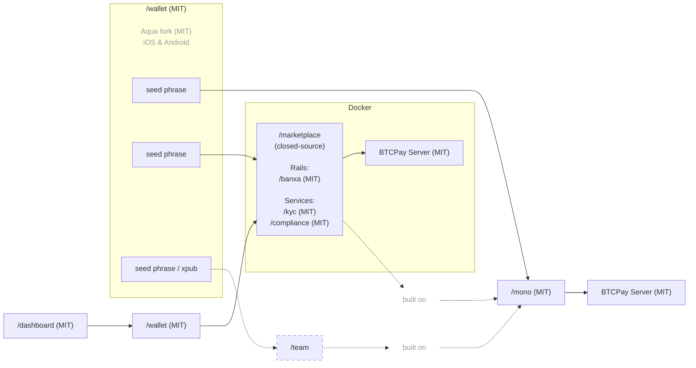
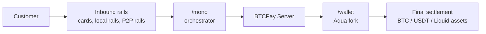

## Local2Coin Documentation

Local2Coin is built on the P2Pagos open-source multi-rail payment infrastructure.

P2Pagos uses:

- [`/mono`](https://github.com/P2Pagos/mono) as the Nuxt-based orchestrator repo.
- [`/wallet`](https://github.com/P2Pagos/wallet) as the mobile self-custodial settlement wallet, based on an Aqua Wallet fork.
- `/dashboard` as the embedded Nuxt mini app for `/wallet` settings and flows, replicable on desktop.
- `/marketplace` as the closed-source multi-user layer built on top of `/mono`.
- [BTCPay Server](https://github.com/btcpayserver/btcpayserver) as the backend for settlement infrastructure.


The stack is designed around:

- inbound rails
- modular services
- self-custodial settlement
- multi-rail payment architecture
- practical cross-border money movement
- reduced dependency on a single processor, bank, country, or rail

---

## Repository roles

| Repository | License | Role | Status |
|------------|---------|------|--------|
| [`/mono`](https://github.com/P2Pagos/mono) | MIT | Nuxt-based orchestrator for rails, flows, services, and shared utilities | Early orchestrator base |
| [`/wallet`](https://github.com/P2Pagos/wallet) | MIT | Aqua Wallet fork for mobile self-custodial settlement and `/dashboard` integration | Planned P2Pagos wallet layer |
| `/dashboard` | MIT | Nuxt mini app embedded into `/wallet` for payment flows and settings | Planned |
| `/marketplace` | Closed-source | Multi-user marketplace layer built on top of `/mono` | Commercial layer |

---

## Architecture



---

## `/mono`

[`/mono`](https://github.com/P2Pagos/mono) is the orchestrator repo for P2Pagos.

It assembles payment rails, business flows, infrastructure services, and shared utilities into a single Nuxt-based workspace.

This repository is still being cleaned up and should be read as an early orchestrator base, not as a finished product.

### Structure

```txt
/
├── nuxt.config.js      root Nuxt app — loads all workspace modules
├── app.vue
├── pages/
├── server/
├── rails/              payment rail modules
├── flows/              business flow modules
├── services/           infrastructure service modules
└── utils/              shared utilities
```

### What `/mono` is not

- Not a finished marketplace.
- Not a polished public SDK.
- Not stable enough yet to promise broad production use.

---

## `/mono` modules

### Rails

Payment rail modules inject pages, composables, and server handlers into the host app. They can also run standalone as Nitro servers.

| Package | Path | Page | API |
|---------|------|------|-----|
| `@p2pagos/template` | `rails/template` | `/rails/template` | `/api/rails/template` |
| `@p2pagos/peach` | `rails/peach` | `/rails/peach` | `/api/rails/peach/*` |
| `@p2pagos/robosats` | `rails/robosats` | `/rails/robosats` | `/api/rails/robosats/*` |

### Flows

Higher-level feature modules with pages and UI components.

| Package | Path | Pages |
|---------|------|-------|
| `@p2pagos/booking` | `flows/booking` | `/flows/booking`, `/flows/booking/embed` |

### Services

Infrastructure modules that run both as standalone Nitro apps and embeddable Nuxt modules.

| Package | Path | Routes | Notes |
|---------|------|--------|-------|
| `@p2pagos/ip` | `services/ip` | — | Rate limiting and IP geolocation, disabled by default |
| `@p2pagos/tor` | `services/tor` | `/api/tor`, `/api/tor/**` | Tor reverse proxy, disabled by default |
| `@p2pagos/market` | `services/market` | `/api/market/**` | KYC-free offer aggregator for Bisq, RoboSats, and Peach, disabled by default |

---

## Inbound multi-rails

| Rail | Status | Currency | Payment Methods | Settlement | Fee | Verification | Privacy |
|------|--------|----------|-----------------|------------|-----|--------------|---------|
| BTC | Implemented | SATS | On-chain & Lightning | Bitcoin on-chain | None | None | Total |
| USDT | Implemented | USD | Liquid & Polygon | USDT Liquid & Polygon | None | None | Total |
| [Peach](https://github.com/P2Pagos/mono/tree/main/rails/peach) *(p2p-api-integration)* | Testing | Global | Any | Bitcoin on-chain | High | None | Total |
| [RoboSats](https://github.com/P2Pagos/mono/tree/main/rails/robosats) *(p2p-api-integration)* | Testing | Global | Any | Bitcoin on-chain | High | None | Total |
| MoonPay ACH USD *(cex-api-integration)* | Designing | USD | ACH | USDT(?) | None | Standard | None |
| Mostro *(p2p-api-integration)* | Evaluating | Global | Any | Bitcoin on-chain | High | None | Total |
| Guardarian *(cex-api-integration)* | Planned | USD, EUR, GBP, CAD, AUD, JPY, TRY, PLN, SEK | Credit/Debit Cards & Google/Apple Pay | Bitcoin on-chain | Medium | None or Standard | Possible with RUC structure |
| Paygate *(cex-api-integration)* | Planned | Global | Credit/Debit Cards | USDT Polygon | Medium | None | Total |
| DePix *(cex-api-integration)* | Planned | BRL | Pix | BRL on Liquid | Low | None | Total |
| Kamipay *(cex-api-integration)* | Planned | BRL | Pix | USDT Polygon | Low | Standard | None |
| MtPelerin *(cex-api-integration)* | Planned | EUR & CHF | SEPA | Bitcoin on-chain or USDT Polygon | Low | Enhanced | Possible with RUC structure |
| Bitzed *(cex-api-integration)* | Planned | ZMW | Mobile money | Bitcoin on-chain | Low | None | Total |
| Matbea *(cex+p2p-api-integration)* | Planned | RUB | Yandex Pay, Sberbank, Tinkoff, YooMoney, SBP P2P, mobile | Bitcoin on-chain | Low | None | Total |

---

## Service modules

| Service | Status | Scope | Purpose | Default |
|---------|--------|-------|---------|---------|
| [ip](https://github.com/P2Pagos/mono/tree/main/services/ip) | Testing | Global | IP geolocation, country detection, currency detection, and rate limiting | Disabled by default |
| [tor](https://github.com/P2Pagos/mono/tree/main/services/tor) | Testing | Global | Tor reverse proxy for onion and Tor-based integrations | Enabled if consumed by an enabled rail |
| [cors](https://github.com/P2Pagos/mono/tree/main/services/cors) | Testing | Global | CORS reverse proxy for target APIs | Enabled if consumed by an enabled rail |
| [market](https://github.com/P2Pagos/mono/tree/main/services/market) | Testing | Global | KYC-free offer aggregation and external offers | Enabled if consumed by an enabled rail |
| invoice | Planned | Multiple countries, many of them in LATAM | Programmatic electronic invoice generation upon payment settlement, based on Invopop, with planned Paraguayan SIFEN integration through TIPS SA modules | Disabled by default |

---

## `/mono` local development

```bash
pnpm install
pnpm dev
pnpm build
pnpm preview
```

---

## `/mono` module loading

The root Nuxt app loads workspace modules through `nuxt.config.js`.

Adding a module requires:

1. Add `"@p2pagos/<name>": "workspace:*"` to root `package.json` dependencies.
2. Add `'@p2pagos/<name>'` to the `modules` array in `nuxt.config.js`.

`flows/booking` requires `@nuxt/ui`. It must be present in `nuxt.config.js` before or alongside the booking module.

---

## `/mono` environment variables

### `services/tor`

| Variable | Required | Default | Description |
|----------|----------|---------|-------------|
| `NUXT_TOR_PROXY_SECRET` | Yes | — | Shared secret sent in `X-Tor-Proxy-Secret` header |
| `NUXT_TOR_SOCKS_URL` | No | `socks5h://127.0.0.1:9050` | SOCKS5h URL of the local Tor daemon |

### `rails/robosats`

| Variable | Required | Default | Description |
|----------|----------|---------|-------------|
| `NUXT_ROBOSATS_COORDINATOR_URL` | No | RoboSats default onion | Coordinator onion base URL |
| `NUXT_TOR_PROXY_SECRET` | Yes | — | Shared secret for the embedded `@p2pagos/tor` proxy |
| `NUXT_TOR_SOCKS_URL` | No | `socks5h://127.0.0.1:9050` | SOCKS5h URL of the local Tor daemon |

### `rails/peach`

| Variable | Required | Default | Description |
|----------|----------|---------|-------------|
| `NUXT_PEACH_BASE_URL` | No | `https://api.peachbitcoin.com` | Peach API base URL |
| `NUXT_PEACH_BITCOIN_MNEMONIC` | Yes | — | BIP39 mnemonic for wallet key derivation |
| `NUXT_PEACH_PGP_PRIVATE_KEY` | Yes | — | Armored PGP private key |
| `NUXT_PEACH_PGP_PUBLIC_KEY` | Yes | — | Armored PGP public key |
| `NUXT_PEACH_PGP_PASSPHRASE` | Yes | — | PGP key passphrase |
| `NUXT_PEACH_REFERRAL_CODE` | No | — | Peach referral code |
| `NUXT_PEACH_FEE_RATE` | No | `hourFee` | Bitcoin fee rate strategy |
| `NUXT_PEACH_MAX_PREMIUM` | No | `0` | Maximum accepted offer premium |

### `services/ip`

| Variable | Required | Default | Description |
|----------|----------|---------|-------------|
| `NUXT_IP_DETECTION_CURRENCY` | No | `false` | Expose currency derived from Cloudflare `cf-ipcountry` header in `event.context.ipDetection` |
| `NUXT_IP_DETECTION_COUNTRY` | No | `false` | Expose country code in `event.context.ipDetection` |
| `NUXT_IP_DETECTION_CLOUDFLARE_SECRET` | No | — | Shared secret to verify requests come through Cloudflare |
| `NUXT_IPINFO_API_KEY` | No | — | IPinfo API key |
| `NUXT_IP_DETECTION_RATE_LIMIT` | No | `100` | Max requests per IP per minute |
| `NUXT_IP_DETECTION_LIMIT_PATHS` | No | — | Comma-separated list of API paths to rate-limit |

### `services/market`

| Variable | Required | Default | Description |
|----------|----------|---------|-------------|
| `NUXT_TOR_PROXY_SECRET` | Yes | — | Auth secret for the inline Tor proxy handler |
| `NUXT_ROBOSATS_COORDINATOR_ONION_URL` | No | RoboSats default onion | RoboSats coordinator onion address |
| `NUXT_TOR_SOCKS_URL` | No | `socks5h://127.0.0.1:9050` | SOCKS5h URL of the local Tor daemon |

---

## `/mono` known issues

| Issue | Detail |
|-------|--------|
| `@nuxt/kit` version mismatch | `rails/peach`, `rails/robosats`, and `services/tor` declare `@nuxt/kit ^3.13.0`, while the root app, `rails/template`, and `flows/booking` use `^4.0.0`. The modules work in module mode via Nuxt's own kit instance, but full standalone migration to `^4.0.0` is pending. |

---

## `/wallet`

[`/wallet`](https://github.com/P2Pagos/wallet) is the mobile self-custodial wallet for P2Pagos, based on an [Aqua Wallet](https://github.com/aquawallet/) fork.

This repository exists because Aqua already provides a strong base for the settlement layer P2Pagos needs, while still allowing extension toward P2Pagos-specific payment flows, settings management, and marketplace integrations.

---

## Why Aqua Wallet

Aqua Wallet was selected as the base for this fork because it already provides:

| Feature | Reason |
|---------|--------|
| Bitcoin and Liquid self-custody | Native self-custodial support with a single seed phrase backup |
| Lightning through Boltz | Swap-to-Liquid flows reduce the need for users to manage channel liquidity directly |
| Liquid stablecoins | Support for multiple Liquid-based stablecoins, currently including USDT and DePix |
| Built-in swaps | Swap capabilities between supported currencies |
| External app marketplace model | Can be replaced by the P2Pagos embedded mini app for `/settings` or `/dashboard` |
| Multiple wallets | Separate seed phrases allow the same user to connect to `/mono` and one or more `/marketplace` accounts |
| Shamrock protocol | Enables simple connection to BTCPay Server |
| Maintenance expectations | Aqua has strong funding and reputation inside the ecosystem |

---

## `/wallet` planned changes

The current fork is intended to evolve into the P2Pagos mobile settlement and configuration wallet.

Planned changes include:

- Add self-custodial Polygon wallet support derived from the existing seed phrase, in order to support USDT on Polygon.
- If needed for future rails settling in USDT on other chains, extend support through USDT0-based interoperability, using Polygon as the main anchor network.
- Replace Aqua's marketplace tab with a dedicated **Payments** tab powered by the `/dashboard` Nuxt mini app.
- Integrate exchange rates from `yadio.io`, which are more representative of real pricing in emerging markets than exchange-only sources such as Kraken.
- Continuously improve core functionality while regularly pulling upstream changes from Aqua.
- Remove the distinction between **Saving Account** for BTC and **Spending Accounts** for other assets, in order to better fit the P2Pagos payment-oriented product model.
- Add Russian and remove unnecessary languages, aligning the wallet with the default language set: EN, ES, PT, FR, IT, RU.
- Rebrand the application as part of the P2Pagos product family.

---

## USDT on Polygon

One of the main planned additions is self-custodial USDT support on Polygon.

The goal is to give users access to a settlement asset that is widely usable across integrable payment rails, while preserving the same wallet ownership model already used for Bitcoin and Liquid assets.

The implementation is designed around:

- deriving Polygon wallet support from the same existing seed phrase;
- supporting USDT on Polygon as a first-class settlement asset;
- using a Flutter EVM stack for Polygon account derivation, signing, and contract interaction;
- evaluating `web3dart` and `onchainlabs_flutter`;
- minimizing user exposure to native-token operational complexity;
- enabling network fee handling through an ERC-4337 paymaster flow;
- abstracting fees from the normal user experience;
- charging fees in USDT instead of requiring manual MATIC management.

This is intended to make USDT settlement operationally simpler for users who need stablecoin-based final settlement without unnecessary wallet fragmentation.

---

## `/dashboard` mini app integration

The `/dashboard` mini app will be integrated into the wallet through a WebView-based approach.

Security model:

| Layer | Responsibility |
|-------|----------------|
| Flutter | Custody of seed phrase and private keys |
| Embedded Nuxt app | Payment UI and settings interface |
| Capability bridge | Limited communication between Flutter and WebView |
| WebView layer | Receives only required data and actions |

The embedded Nuxt app does not receive direct access to secrets.

The bridge is limited to the data and actions required for the payment UI, such as:

- receiving addresses
- basic wallet context
- signing requests

This keeps sensitive key material inside the native wallet layer while allowing P2Pagos-specific flows and settings to be built in Nuxt.

---

## `/wallet` scope

The `/wallet` repository should be read as the mobile wallet layer of the broader P2Pagos architecture.

It is not just a generic wallet fork.

Its purpose is to provide:

- self-custodial settlement for Bitcoin, Liquid assets, and future supported rails;
- secure connection to BTCPay Server and related payment infrastructure;
- an embedded interface for `/dashboard` and payment-related flows;
- a mobile foundation for users interacting with `/mono` instances and connected marketplace environments.

---

## Settlement flow summary



---

## Operational model

| Layer | Function |
|-------|----------|
| Inbound rails | Accept or route payments through supported payment methods |
| `/mono` | Assemble rails, flows, services, and API handlers |
| BTCPay Server | Settlement backend and payment infrastructure |
| `/wallet` | Self-custodial mobile settlement and configuration layer |
| `/dashboard` | Embedded Nuxt interface for payment settings and flows |
| `/marketplace` | Multi-user commercial layer built on top of `/mono` |

---

## Current status

P2Pagos is still evolving.

Some components exist as working integrations. Others are partial, experimental, planned, or still being assembled into the main orchestrator.

The repositories should be read as active infrastructure work, not as a finished product suite.