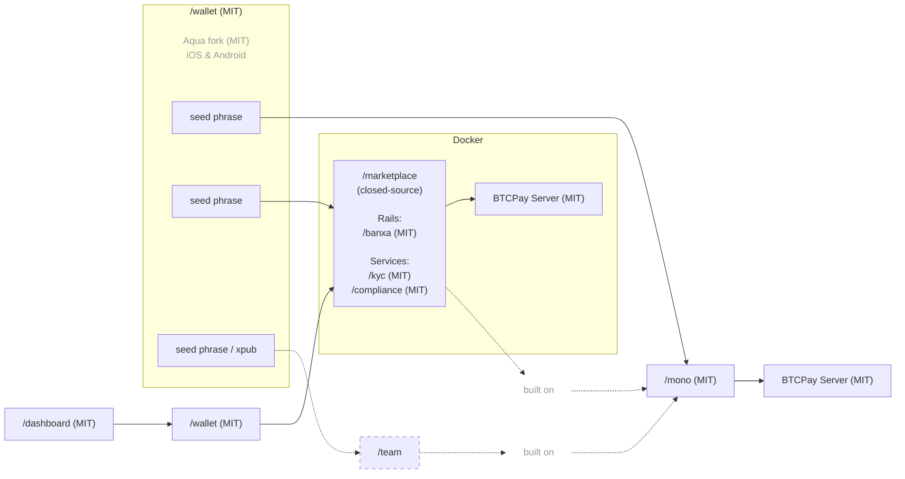

## Infrastructure

P2Pagos uses [BTCPay Server](https://github.com/btcpayserver/btcpayserver) as the backend and an [Aqua Wallet](https://github.com/AquaWallet/aqua-wallet) fork as the default settlement wallet.

BTCPay Server was chosen because it is a battle-tested, widely adopted, and community-maintained API and GUI backend with built-in support for Bitcoin on-chain, Lightning, and Liquid payment processing.

We actively contribute to its [core and plugin ecosystem](https://github.com/search?q=involves%3Alearntheropes+%28org%3Abtcpayserver+OR+org%3Abtcpayserver-tether+OR+org%3Amempool%29&type=issues).

Aqua Wallet was chosen because it supports self-custodial settlement in Bitcoin and Liquid assets, including USDT and DePix, from a single seed phrase.

It also supports:

- BTC on-chain settlement
- Liquid stablecoin settlement
- swap-to-Liquid flows through Boltz
- Shamrock protocol connection to BTCPay Server
- multiple wallet contexts based on separate seed phrases
- a mobile base for future P2Pagos-specific payment flows

The P2Pagos wallet fork is intended to evolve into the mobile settlement and configuration layer for `/mono`, `/dashboard`, and marketplace environments.

## Settlement options

Local2Coin can settle through different wallet setups depending on the use case.

Current and planned options include:

- Aqua Wallet
- Nunchuk
- Tether Wallet
- Sparrow
- multisig hardware wallet setups
- BTCPay Server wallets
- future P2Pagos Wallet support

The right setup depends on the merchant profile, marketplace model, ticket size, settlement asset, security requirements, local payment method, and operational capacity.

## Supported settlement assets

BTC, USDT, and USDC are supported by default.

Additional Bitcoin and stablecoin settlement routes can be evaluated depending on the market, wallet support, local rail, and business need.

If an inbound rail does not already settle into an asset supported by the wallet layer, P2Pagos aims to convert it into the supported asset that is cheapest and most functional for that case.

## Custodial and self-custodial modes

Local2Coin is designed to support both self-custodial and custodial modes.

The self-custodial flow is ready.

The custodial flow is in development, both on the technology side and on the legal and operational side.

In the self-custodial model, the merchant, creator, or final recipient controls settlement directly through supported wallets and infrastructure.

In the custodial model, additional legal, compliance, operational, and technical requirements apply before production use.

## Inbound multi-rails

| Rail | Status | Currency | Payment Methods | Settlement | Fee | Verification | Privacy |
|------|--------|----------|-----------------|------------|-----|--------------|---------|
| BTC | Implemented | BTC | On-chain & Lightning | Bitcoin on-chain | None | None | Total |
| USDT | Implemented | USDT | Liquid & Polygon | USDT Liquid & Polygon | None | None | Total |
| [Peach](https://github.com/P2Pagos/mono/tree/main/rails/peach) *(p2p-api-integration)* | Testing | Global | Any | Bitcoin on-chain | High | None | Total |
| [RoboSats](https://github.com/P2Pagos/mono/tree/main/rails/robosats) *(p2p-api-integration)* | Testing | Global | Any | Bitcoin on-chain | High | None | Total |
| MoonPay ACH USD *(cex-api-integration)* | Designing | USD | ACH | TBD | TBD | Standard | None |
| Mostro *(p2p-api-integration)* | Evaluating | Global | Any | Bitcoin on-chain | High | None | Total |
| Guardarian *(cex-api-integration)* | Planned | USD, EUR, GBP, CAD, AUD, JPY, TRY, PLN, SEK | Credit/Debit Cards & Google/Apple Pay | Bitcoin on-chain | Medium | None or Standard | Possible with RUC structure |
| Paygate *(cex-api-integration)* | Planned | Global | Credit/Debit Cards | USDT Polygon | Medium | None | Total |
| DePix *(cex-api-integration)* | Planned | BRL | Pix | BRL on Liquid | Low | None | Total |
| Kamipay *(cex-api-integration)* | Planned | BRL | Pix | USDT Polygon | Low | Standard | None |
| MtPelerin *(cex-api-integration)* | Planned | EUR & CHF | SEPA | Bitcoin on-chain or USDT Polygon | Low | Enhanced | Possible with RUC structure |
| Bitzed *(cex-api-integration)* | Planned | ZMW | Mobile money | Bitcoin on-chain | Low | None | Total |
| Matbea *(cex+p2p-api-integration)* | Planned | RUB | Yandex Pay, Sberbank, Tinkoff, YooMoney, SBP P2P, mobile | Bitcoin on-chain | Low | None | Total |

## Service modules

| Service | Status | Scope | Purpose | Default |
|---------|--------|-------|---------|---------|
| [ip](https://github.com/P2Pagos/mono/tree/main/services/ip) | Testing | Global | IP geolocation and currency detection | Disabled by default; Cloudflare country and currency detection can be enabled |
| [tor](https://github.com/P2Pagos/mono/tree/main/services/tor) | Testing | Global | Tor reverse proxy for onion and Tor-based integrations | Enabled if consumed by an enabled rail |
| [cors](https://github.com/P2Pagos/mono/tree/main/services/cors) | Testing | Global | CORS reverse proxy for target APIs | Enabled if consumed by an enabled rail |
| [market](https://github.com/P2Pagos/mono/tree/main/services/market) | Testing | Global | KYC-free offer aggregation and external offers | Enabled if consumed by an enabled rail |
| invoice | Planned | LATAM and other supported countries | Programmatic invoice generation upon payment settlement using Invopop, with planned Paraguayan SIFEN support through TIPS SA modules | Disabled by default |

## Architecture

The core orchestrator, [`/mono`](https://github.com/P2Pagos/mono), is an MIT licensed Nuxt-based workspace that assembles rails, flows, and services.

## Active repositories

### [`/mono`](https://github.com/P2Pagos/mono)

Single-user orchestrator. MIT licensed.

Assembles rails, business flows, and infrastructure services into one Nuxt-based workspace.

Current modules:

- `rails/peach`
- `rails/robosats`
- `flows/booking`
- `services/ip`
- `services/tor`
- `services/market`

### [`/wallet`](https://github.com/P2Pagos/wallet)

Mobile self-custodial wallet based on an Aqua Wallet fork. MIT licensed.

Intended to provide:

- self-custodial Bitcoin and Liquid settlement
- USDT on Polygon (planned)
- Shamrock connection to BTCPay Server
- embedded `/dashboard` mini app
- payment settings management
- marketplace account support
- multiple wallet contexts from separate seed phrases

### `/dashboard`

Nuxt-based MIT app intended to handle payment flows through an embedded interface in the wallet.

### `/marketplace`

Closed-source multi-user marketplace layer built on top of `/mono`.

Intended for platform integrations where the marketplace needs user management, payment option controls, membership plans, creator settlement configuration, and compliance triggers.
