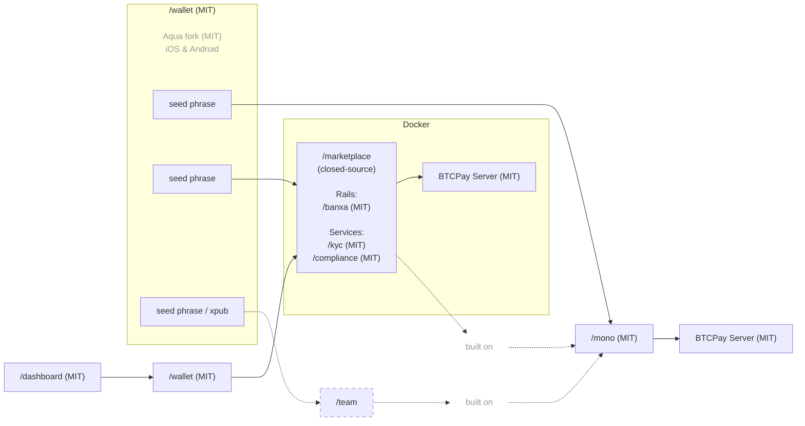
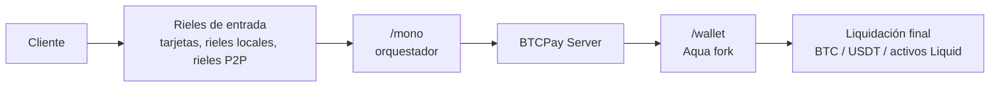

## Documentación Local2Coin

Local2Coin está construido sobre la infraestructura de pago multi-canal open-source de P2Pagos.

P2Pagos utiliza:

- [`/mono`](https://github.com/P2Pagos/mono) como el repositorio orquestador basado en Nuxt.
- [`/wallet`](https://github.com/P2Pagos/wallet) como la wallet de liquidación self-custodial móvil, basada en un fork de Aqua Wallet.
- `/dashboard` como la mini app Nuxt integrada en `/wallet` para configuraciones y flujos.
- `/marketplace` como la capa multi-usuario closed-source construida sobre `/mono`.
- [BTCPay Server](https://github.com/btcpayserver/btcpayserver) como el backend para la infraestructura de liquidación.

El stack está diseñado alrededor de:

- rieles de entrada
- servicios modulares
- liquidación self-custodial
- arquitectura de pago multi-canal
- movimiento de dinero transfronterizo práctico
- dependencia reducida de un solo procesador, banco, país o canal

---

## Roles de los repositorios

| Repositorio | Licencia | Rol | Estado |
|------------|---------|------|--------|
| [`/mono`](https://github.com/P2Pagos/mono) | MIT | Orquestador Nuxt para rieles, flujos, servicios y utilidades compartidas | Base orquestadora inicial |
| [`/wallet`](https://github.com/P2Pagos/wallet) | MIT | Fork de Aqua Wallet para liquidación self-custodial móvil e integración `/dashboard` | Capa wallet P2Pagos planificada |
| `/dashboard` | MIT | Mini app Nuxt integrada en `/wallet` para flujos de pago y configuración | Planificado |
| `/marketplace` | Closed-source | Capa marketplace multi-usuario construida sobre `/mono` | Capa comercial |

---

## Arquitectura



---

## `/mono`

[`/mono`](https://github.com/P2Pagos/mono) es el repositorio orquestador de P2Pagos.

Ensambla rieles de pago, flujos de negocio, servicios de infraestructura y utilidades compartidas en un único workspace basado en Nuxt.

Este repositorio aún está siendo ordenado y debe leerse como una base orquestadora inicial, no como un producto terminado.

### Estructura

```txt
/
├── nuxt.config.js      app Nuxt raíz — carga todos los módulos del workspace
├── app.vue
├── pages/
├── server/
├── rails/              módulos de rieles de pago
├── flows/              módulos de flujos de negocio
├── services/           módulos de servicios de infraestructura
└── utils/              utilidades compartidas
```

### Lo que `/mono` no es

- No es un marketplace terminado.
- No es un SDK público pulido.
- No está suficientemente estable para garantizar uso amplio en producción.

---

## Módulos de `/mono`

### Rieles

Los módulos de rieles de pago inyectan páginas, composables y handlers de servidor en la app host. También pueden ejecutarse de forma autónoma como servidores Nitro.

| Paquete | Ruta | Página | API |
|---------|------|------|-----|
| `@p2pagos/template` | `rails/template` | `/rails/template` | `/api/rails/template` |
| `@p2pagos/peach` | `rails/peach` | `/rails/peach` | `/api/rails/peach/*` |
| `@p2pagos/robosats` | `rails/robosats` | `/rails/robosats` | `/api/rails/robosats/*` |

### Flujos

Módulos de funcionalidades de alto nivel con páginas y componentes UI.

| Paquete | Ruta | Páginas |
|---------|------|-------|
| `@p2pagos/booking` | `flows/booking` | `/flows/booking`, `/flows/booking/embed` |

### Servicios

Módulos de infraestructura que funcionan tanto como apps Nitro autónomas como módulos Nuxt integrables.

| Paquete | Ruta | Rutas | Notas |
|---------|------|--------|-------|
| `@p2pagos/ip` | `services/ip` | — | Limitación de velocidad y geolocalización IP, deshabilitado por defecto |
| `@p2pagos/tor` | `services/tor` | `/api/tor`, `/api/tor/**` | Proxy inverso Tor, deshabilitado por defecto |
| `@p2pagos/market` | `services/market` | `/api/market/**` | Agregador de ofertas sin KYC para Bisq, RoboSats y Peach, deshabilitado por defecto |

---

## Rieles de entrada multi-canal

| Canal | Estado | Moneda | Métodos de pago | Liquidación | Comisión | Verificación | Privacidad |
|------|--------|----------|-----------------|------------|-----|--------------|---------|
| BTC | Implementado | SATS | On-chain y Lightning | Bitcoin on-chain | Ninguna | Ninguna | Total |
| USDT | Implementado | USD | Liquid y Polygon | USDT Liquid y Polygon | Ninguna | Ninguna | Total |
| [Peach](https://github.com/P2Pagos/mono/tree/main/rails/peach) *(p2p-api-integration)* | Testing | Global | Cualquiera | Bitcoin on-chain | Alta | Ninguna | Total |
| [RoboSats](https://github.com/P2Pagos/mono/tree/main/rails/robosats) *(p2p-api-integration)* | Testing | Global | Cualquiera | Bitcoin on-chain | Alta | Ninguna | Total |
| MoonPay ACH USD *(cex-api-integration)* | Diseñando | USD | ACH | USDT(?) | Ninguna | Estándar | Ninguna |
| Mostro *(p2p-api-integration)* | Evaluando | Global | Cualquiera | Bitcoin on-chain | Alta | Ninguna | Total |
| Guardarian *(cex-api-integration)* | Planificado | USD, EUR, GBP, CAD, AUD, JPY, TRY, PLN, SEK | Tarjetas crédito/débito y Google/Apple Pay | Bitcoin on-chain | Media | Ninguna o Estándar | Posible con estructura RUC |
| Paygate *(cex-api-integration)* | Planificado | Global | Tarjetas crédito/débito | USDT Polygon | Media | Ninguna | Total |
| DePix *(cex-api-integration)* | Planificado | BRL | Pix | BRL en Liquid | Baja | Ninguna | Total |
| Kamipay *(cex-api-integration)* | Planificado | BRL | Pix | USDT Polygon | Baja | Estándar | Ninguna |
| MtPelerin *(cex-api-integration)* | Planificado | EUR y CHF | SEPA | Bitcoin on-chain o USDT Polygon | Baja | Reforzada | Posible con estructura RUC |
| Bitzed *(cex-api-integration)* | Planificado | ZMW | Mobile money | Bitcoin on-chain | Baja | Ninguna | Total |
| Matbea *(cex+p2p-api-integration)* | Planificado | RUB | Yandex Pay, Sberbank, Tinkoff, YooMoney, SBP P2P, móvil | Bitcoin on-chain | Baja | Ninguna | Total |

---

## Módulos de servicio

| Servicio | Estado | Alcance | Propósito | Por defecto |
|---------|--------|-------|---------|---------|
| [ip](https://github.com/P2Pagos/mono/tree/main/services/ip) | Testing | Global | Geolocalización IP, detección de país y moneda, limitación de velocidad | Deshabilitado por defecto |
| [tor](https://github.com/P2Pagos/mono/tree/main/services/tor) | Testing | Global | Proxy inverso Tor para integraciones onion | Habilitado si lo consume un canal activo |
| [cors](https://github.com/P2Pagos/mono/tree/main/services/cors) | Testing | Global | Proxy inverso CORS para APIs destino | Habilitado si lo consume un canal activo |
| [market](https://github.com/P2Pagos/mono/tree/main/services/market) | Testing | Global | Agregación de ofertas sin KYC y ofertas externas | Habilitado si lo consume un canal activo |
| invoice | Planificado | Múltiples países, muchos en LATAM | Generación programática de facturas electrónicas al liquidar el pago, basado en Invopop, con integración SIFEN Paraguay planificada a través de módulos TIPS SA | Deshabilitado por defecto |

---

## Desarrollo local de `/mono`

```bash
pnpm install
pnpm dev
pnpm build
pnpm preview
```

---

## Carga de módulos en `/mono`

La app Nuxt raíz carga los módulos del workspace a través de `nuxt.config.js`.

Agregar un módulo requiere:

1. Añadir `"@p2pagos/<name>": "workspace:*"` a las dependencias del `package.json` raíz.
2. Añadir `'@p2pagos/<name>'` al array `modules` en `nuxt.config.js`.

`flows/booking` requiere `@nuxt/ui`. Debe estar presente en `nuxt.config.js` antes o junto al módulo de booking.

---

## Variables de entorno de `/mono`

### `services/tor`

| Variable | Requerida | Por defecto | Descripción |
|----------|----------|---------|-------------|
| `NUXT_TOR_PROXY_SECRET` | Sí | — | Secreto compartido enviado en el header `X-Tor-Proxy-Secret` |
| `NUXT_TOR_SOCKS_URL` | No | `socks5h://127.0.0.1:9050` | URL SOCKS5h del daemon Tor local |

### `rails/robosats`

| Variable | Requerida | Por defecto | Descripción |
|----------|----------|---------|-------------|
| `NUXT_ROBOSATS_COORDINATOR_URL` | No | Onion por defecto de RoboSats | URL onion base del coordinador |
| `NUXT_TOR_PROXY_SECRET` | Sí | — | Secreto compartido para el proxy `@p2pagos/tor` integrado |
| `NUXT_TOR_SOCKS_URL` | No | `socks5h://127.0.0.1:9050` | URL SOCKS5h del daemon Tor local |

### `rails/peach`

| Variable | Requerida | Por defecto | Descripción |
|----------|----------|---------|-------------|
| `NUXT_PEACH_BASE_URL` | No | `https://api.peachbitcoin.com` | URL base de la API de Peach |
| `NUXT_PEACH_BITCOIN_MNEMONIC` | Sí | — | Mnemónico BIP39 para derivación de claves de wallet |
| `NUXT_PEACH_PGP_PRIVATE_KEY` | Sí | — | Clave privada PGP en formato armored |
| `NUXT_PEACH_PGP_PUBLIC_KEY` | Sí | — | Clave pública PGP en formato armored |
| `NUXT_PEACH_PGP_PASSPHRASE` | Sí | — | Frase de contraseña de la clave PGP |
| `NUXT_PEACH_REFERRAL_CODE` | No | — | Código de referido de Peach |
| `NUXT_PEACH_FEE_RATE` | No | `hourFee` | Estrategia de tarifa de comisión de Bitcoin |
| `NUXT_PEACH_MAX_PREMIUM` | No | `0` | Prima máxima aceptada en ofertas |

### `services/ip`

| Variable | Requerida | Por defecto | Descripción |
|----------|----------|---------|-------------|
| `NUXT_IP_DETECTION_CURRENCY` | No | `false` | Expone la moneda derivada del header `cf-ipcountry` de Cloudflare en `event.context.ipDetection` |
| `NUXT_IP_DETECTION_COUNTRY` | No | `false` | Expone el código de país en `event.context.ipDetection` |
| `NUXT_IP_DETECTION_CLOUDFLARE_SECRET` | No | — | Secreto compartido para verificar que las solicitudes vienen a través de Cloudflare |
| `NUXT_IPINFO_API_KEY` | No | — | API key de IPinfo |
| `NUXT_IP_DETECTION_RATE_LIMIT` | No | `100` | Máximo de solicitudes por IP por minuto |
| `NUXT_IP_DETECTION_LIMIT_PATHS` | No | — | Lista de rutas API separadas por coma para limitar la velocidad |

### `services/market`

| Variable | Requerida | Por defecto | Descripción |
|----------|----------|---------|-------------|
| `NUXT_TOR_PROXY_SECRET` | Sí | — | Secreto de autenticación para el handler del proxy Tor inline |
| `NUXT_ROBOSATS_COORDINATOR_ONION_URL` | No | Onion por defecto de RoboSats | Dirección onion del coordinador de RoboSats |
| `NUXT_TOR_SOCKS_URL` | No | `socks5h://127.0.0.1:9050` | URL SOCKS5h del daemon Tor local |

---

## Problemas conocidos de `/mono`

| Problema | Detalle |
|-------|--------|
| Incompatibilidad de versión de `@nuxt/kit` | `rails/peach`, `rails/robosats` y `services/tor` declaran `@nuxt/kit ^3.13.0`, mientras que la app raíz, `rails/template` y `flows/booking` usan `^4.0.0`. Los módulos funcionan en modo módulo a través de la instancia kit de Nuxt, pero la migración completa standalone a `^4.0.0` está pendiente. |

---

## `/wallet`

[`/wallet`](https://github.com/P2Pagos/wallet) es la wallet móvil self-custodial de P2Pagos, basada en un fork de [Aqua Wallet](https://github.com/aquawallet/).

Este repositorio existe porque Aqua ya proporciona una base sólida para la capa de liquidación que P2Pagos necesita, al tiempo que permite extenderla hacia flujos de pago específicos de P2Pagos, gestión de configuración e integraciones con marketplaces.

---

## Por qué Aqua Wallet

Aqua Wallet fue seleccionada como base de este fork porque ya ofrece:

| Funcionalidad | Razón |
|---------|--------|
| Self-custody de Bitcoin y Liquid | Soporte self-custodial nativo con un único backup de seed phrase |
| Lightning a través de Boltz | Los flujos swap-to-Liquid reducen la necesidad de que los usuarios gestionen la liquidez de canales directamente |
| Stablecoins en Liquid | Soporte para múltiples stablecoins basadas en Liquid, actualmente USDT y DePix |
| Swaps integrados | Capacidad de swap entre monedas soportadas |
| Modelo de marketplace externo | Puede reemplazarse por la mini app integrada de P2Pagos para `/settings` o `/dashboard` |
| Múltiples wallets | Las seed phrases separadas permiten al mismo usuario conectarse a `/mono` y a una o más cuentas `/marketplace` |
| Protocolo Shamrock | Permite conexión simple a BTCPay Server |
| Expectativas de mantenimiento | Aqua tiene financiación sólida y buena reputación en el ecosistema |

---

## Cambios planificados en `/wallet`

El fork actual está pensado para evolucionar hacia la wallet móvil de liquidación y configuración de P2Pagos.

Los cambios planificados incluyen:

- Añadir soporte de wallet Polygon self-custodial derivado de la seed phrase existente, para soportar USDT en Polygon.
- Si es necesario para futuros rieles que liquiden en USDT en otras cadenas, extender soporte a través de interoperabilidad basada en USDT0, usando Polygon como red ancla principal.
- Reemplazar la pestaña de marketplace de Aqua por una pestaña **Pagos** dedicada, impulsada por la mini app Nuxt `/dashboard`.
- Integrar tasas de cambio de `yadio.io`, más representativas del precio real en mercados emergentes que fuentes solo de exchanges como Kraken.
- Mejorar continuamente la funcionalidad base incorporando regularmente cambios upstream de Aqua.
- Eliminar la distinción entre **Saving Account** para BTC y **Spending Accounts** para otros activos, para adaptarse mejor al modelo de producto orientado a pagos de P2Pagos.
- Añadir ruso y eliminar idiomas innecesarios, alineando la wallet con el conjunto de idiomas por defecto: EN, ES, PT, FR, IT, RU.
- Hacer un rebranding de la aplicación como parte de la familia de productos P2Pagos.

---

## USDT en Polygon

Una de las principales incorporaciones planificadas es el soporte self-custodial de USDT en Polygon.

El objetivo es dar a los usuarios acceso a un activo de liquidación ampliamente usable en los rieles de pago integrables, preservando el mismo modelo de propiedad de wallet ya utilizado para Bitcoin y activos Liquid.

La implementación está diseñada en torno a:

- derivar el soporte de wallet Polygon de la misma seed phrase existente;
- soportar USDT en Polygon como activo de liquidación de primera clase;
- usar un stack EVM en Flutter para derivación de cuentas Polygon, firma e interacción con contratos;
- evaluar `web3dart` y `onchainlabs_flutter`;
- minimizar la exposición del usuario a la complejidad operativa del token nativo;
- gestionar las comisiones de red a través de un flujo ERC-4337 paymaster;
- abstraer las comisiones de la experiencia normal del usuario;
- cobrar comisiones en USDT en lugar de requerir gestión manual de MATIC.

Esto está pensado para hacer la liquidación en USDT operativamente más simple para usuarios que necesitan liquidación final en stablecoins sin fragmentación innecesaria de wallets.

---

## Integración de la mini app `/dashboard`

La mini app `/dashboard` se integrará en la wallet mediante un enfoque basado en WebView.

Modelo de seguridad:

| Capa | Responsabilidad |
|-------|----------------|
| Flutter | Custodia de la seed phrase y claves privadas |
| App Nuxt integrada | UI de pagos e interfaz de configuración |
| Puente de capacidades | Comunicación limitada entre Flutter y WebView |
| Capa WebView | Recibe solo los datos y acciones requeridos |

La app Nuxt integrada no recibe acceso directo a los secretos.

El puente está limitado a los datos y acciones requeridos para la UI de pagos:

- direcciones de recepción
- contexto básico de wallet
- solicitudes de firma

Esto mantiene el material sensible de claves dentro de la capa nativa de wallet mientras permite construir flujos y configuraciones específicos de P2Pagos en Nuxt.

---

## Alcance de `/wallet`

El repositorio `/wallet` debe leerse como la capa de wallet móvil de la arquitectura más amplia de P2Pagos.

No es solo un fork de wallet genérico.

Su propósito es proporcionar:

- liquidación self-custodial para Bitcoin, activos Liquid y futuros rieles soportados;
- conexión segura a BTCPay Server e infraestructura de pago relacionada;
- una interfaz integrada para `/dashboard` y flujos relacionados con pagos;
- una base móvil para usuarios que interactúan con instancias de `/mono` y entornos de marketplace conectados.

---

## Resumen del flujo de liquidación



---

## Modelo operativo

| Capa | Función |
|-------|----------|
| Rieles de entrada | Aceptar o enrutar pagos a través de métodos de pago soportados |
| `/mono` | Ensamblar rieles, flujos, servicios y handlers de API |
| BTCPay Server | Backend de liquidación e infraestructura de pago |
| `/wallet` | Capa móvil self-custodial de liquidación y configuración |
| `/dashboard` | Interfaz Nuxt integrada para configuración y flujos de pago |
| `/marketplace` | Capa comercial multi-usuario construida sobre `/mono` |

---

## Estado actual

P2Pagos está en evolución.

Algunos componentes existen como integraciones funcionales. Otros son parciales, experimentales, planificados o aún siendo ensamblados en el orquestador principal.

Los repositorios deben leerse como trabajo de infraestructura activo, no como un conjunto de productos terminados.
