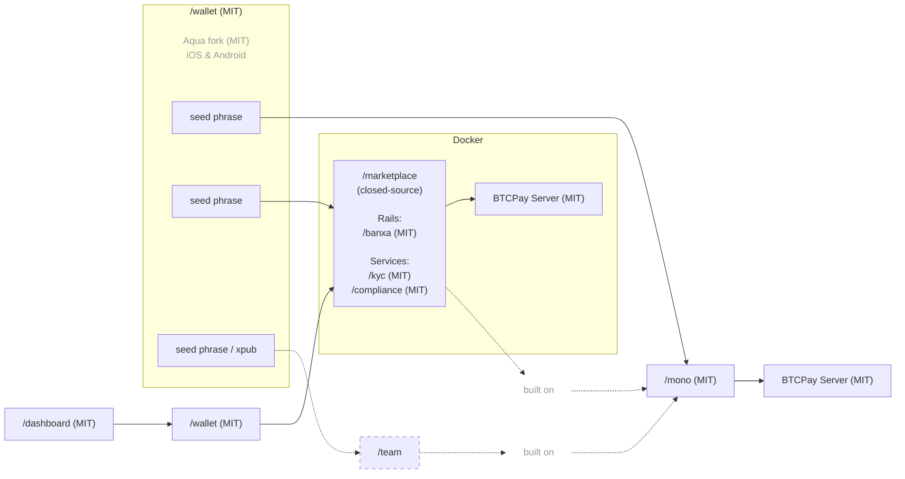

## Local2Coin Documentatie

Local2Coin is gebouwd op de P2Pagos open-source multi-rail betalingsinfrastructuur.

P2Pagos gebruikt:

- [`/mono`](https://github.com/P2Pagos/mono) als de Nuxt-gebaseerde orchestrator repo.
- [`/wallet`](https://github.com/P2Pagos/wallet) als de mobiele zelfbewarende afwikkelingswallet, gebaseerd op een Aqua Wallet fork.
- `/dashboard` als de ingebedde Nuxt mini-app voor `/wallet`-instellingen en stromen, repliceerbaar op desktop.
- `/marketplace` als de gesloten-source multi-user laag bovenop `/mono`.
- [BTCPay Server](https://github.com/btcpayserver/btcpayserver) als backend voor afwikkelingsinfrastructuur.

De stack is ontworpen rond:

- inkomende rails
- modulaire services
- zelfbewarende afwikkeling
- multi-rail betalingsarchitectuur
- praktische grensoverschrijdende geldbeweging
- verminderde afhankelijkheid van één processor, bank, land of rail

---

## Repository-rollen

| Repository | Licentie | Rol | Status |
|------------|---------|------|--------|
| [`/mono`](https://github.com/P2Pagos/mono) | MIT | Nuxt-gebaseerde orchestrator voor rails, stromen, services en gedeelde utilities | Vroege orchestratorbasis |
| [`/wallet`](https://github.com/P2Pagos/wallet) | MIT | Aqua Wallet fork voor mobiele zelfbewarende afwikkeling en `/dashboard`-integratie | Geplande P2Pagos wallet-laag |
| `/dashboard` | MIT | Nuxt mini-app ingebed in `/wallet` voor betalingsstromen en instellingen | Gepland |
| `/marketplace` | Gesloten-source | Multi-user marketplace-laag bovenop `/mono` | Commerciële laag |

---

## Architectuur



---

## `/mono`

[`/mono`](https://github.com/P2Pagos/mono) is de orchestrator repo voor P2Pagos.

Het combineert betalingsrails, bedrijfsstromen, infrastructuurservices en gedeelde utilities in één Nuxt-gebaseerde workspace.

Deze repository is nog in opruiming en moet worden gelezen als een vroege orchestratorbasis, niet als een afgewerkt product.

### Structuur

```txt
/
├── nuxt.config.js      root Nuxt app — laadt alle workspace-modules
├── app.vue
├── pages/
├── server/
├── rails/              betalingsrail-modules
├── flows/              bedrijfsstroom-modules
├── services/           infrastructuurservice-modules
└── utils/              gedeelde utilities
```

### Wat `/mono` niet is

- Geen afgewerkte marketplace.
- Geen gepolijste publieke SDK.
- Nog niet stabiel genoeg voor brede productiebelofte.

---

## `/mono` modules

### Rails

Betalingsrail-modules injecteren pagina's, composables en serverhandlers in de hostapp. Ze kunnen ook standalone draaien als Nitro-servers.

| Package | Pad | Pagina | API |
|---------|------|------|-----|
| `@p2pagos/template` | `rails/template` | `/rails/template` | `/api/rails/template` |
| `@p2pagos/peach` | `rails/peach` | `/rails/peach` | `/api/rails/peach/*` |
| `@p2pagos/robosats` | `rails/robosats` | `/rails/robosats` | `/api/rails/robosats/*` |

### Flows

Modules op hoger niveau met pagina's en UI-componenten.

| Package | Pad | Pagina's |
|---------|------|-------|
| `@p2pagos/booking` | `flows/booking` | `/flows/booking`, `/flows/booking/embed` |

### Services

Infrastructuurmodules die zowel standalone als ingebedde Nuxt-modules draaien.

| Package | Pad | Routes | Opmerkingen |
|---------|------|--------|-------|
| `@p2pagos/ip` | `services/ip` | — | Rate limiting en IP-geolocatie, standaard uitgeschakeld |
| `@p2pagos/tor` | `services/tor` | `/api/tor`, `/api/tor/**` | Tor reverse proxy, standaard uitgeschakeld |
| `@p2pagos/market` | `services/market` | `/api/market/**` | KYC-vrije aanbiedingsaggregator voor Bisq, RoboSats en Peach, standaard uitgeschakeld |

---

## Inkomende multi-rails

| Rail | Status | Valuta | Betaalmethoden | Afwikkeling | Fee | Verificatie | Privacy |
|------|--------|----------|-----------------|------------|-----|--------------|---------|
| BTC | Geïmplementeerd | SATS | On-chain & Lightning | Bitcoin on-chain | Geen | Geen | Totaal |
| USDT | Geïmplementeerd | USD | Liquid & Polygon | USDT Liquid & Polygon | Geen | Geen | Totaal |
| [Peach](https://github.com/P2Pagos/mono/tree/main/rails/peach) | Testen | Globaal | Alle | Bitcoin on-chain | Hoog | Geen | Totaal |
| [RoboSats](https://github.com/P2Pagos/mono/tree/main/rails/robosats) | Testen | Globaal | Alle | Bitcoin on-chain | Hoog | Geen | Totaal |
| MoonPay ACH USD | Ontwerpen | USD | ACH | USDT(?) | Geen | Standaard | Geen |
| Guardarian | Gepland | USD, EUR, GBP, CAD, AUD, JPY, TRY, PLN, SEK | Credit/Debitkaarten & Google/Apple Pay | Bitcoin on-chain | Gemiddeld | Geen of Standaard | Mogelijk met RUC-structuur |
| Paygate | Gepland | Globaal | Credit/Debitkaarten | USDT Polygon | Gemiddeld | Geen | Totaal |
| DePix | Gepland | BRL | Pix | BRL op Liquid | Laag | Geen | Totaal |
| Kamipay | Gepland | BRL | Pix | USDT Polygon | Laag | Standaard | Geen |
| MtPelerin | Gepland | EUR & CHF | SEPA | Bitcoin on-chain of USDT Polygon | Laag | Verbeterd | Mogelijk met RUC-structuur |
| Bitzed | Gepland | ZMW | Mobile money | Bitcoin on-chain | Laag | Geen | Totaal |
| Matbea | Gepland | RUB | Yandex Pay, Sberbank, Tinkoff, YooMoney, SBP P2P, mobiel | Bitcoin on-chain | Laag | Geen | Totaal |

---

## Servicemodules

| Service | Status | Bereik | Doel | Standaard |
|---------|--------|-------|---------|---------|
| [ip](https://github.com/P2Pagos/mono/tree/main/services/ip) | Testen | Globaal | IP-geolocatie, landdetectie, valutadetectie en rate limiting | Standaard uitgeschakeld |
| [tor](https://github.com/P2Pagos/mono/tree/main/services/tor) | Testen | Globaal | Tor reverse proxy voor onion- en Tor-gebaseerde integraties | Ingeschakeld als verbruikt door een ingeschakelde rail |
| [cors](https://github.com/P2Pagos/mono/tree/main/services/cors) | Testen | Globaal | CORS reverse proxy voor doel-API's | Ingeschakeld als verbruikt door een ingeschakelde rail |
| [market](https://github.com/P2Pagos/mono/tree/main/services/market) | Testen | Globaal | KYC-vrije aanbiedingsaggregatie en externe aanbiedingen | Ingeschakeld als verbruikt door een ingeschakelde rail |
| invoice | Gepland | Meerdere landen | Programmatische elektronische factuurgeneratie bij betalingsafwikkeling, gebaseerd op Invopop, met geplande Paraguayaanse SIFEN-integratie | Standaard uitgeschakeld |

---

## `/mono` lokale ontwikkeling

```bash
pnpm install
pnpm dev
pnpm build
pnpm preview
```

---

## `/mono` module laden

De root Nuxt app laadt workspace-modules via `nuxt.config.js`.

Een module toevoegen vereist:

1. Voeg `"@p2pagos/<naam>": "workspace:*"` toe aan root `package.json` dependencies.
2. Voeg `'@p2pagos/<naam>'` toe aan de `modules`-array in `nuxt.config.js`.

`flows/booking` vereist `@nuxt/ui`.

---

## `/wallet`

[`/wallet`](https://github.com/P2Pagos/wallet) is de mobiele zelfbewarende wallet voor P2Pagos, gebaseerd op een [Aqua Wallet](https://github.com/aquawallet/) fork.

### Waarom Aqua Wallet

| Functie | Reden |
|---------|--------|
| Bitcoin en Liquid zelfbewaring | Native zelfbewarende ondersteuning met één seed phrase backup |
| Lightning via Boltz | Swap-naar-Liquid stromen verminderen de noodzaak voor gebruikers om kanaallikwiditeit direct te beheren |
| Liquid stablecoins | Ondersteuning voor meerdere Liquid-gebaseerde stablecoins, momenteel inclusief USDT en DePix |
| Ingebouwde swaps | Swap-mogelijkheden tussen ondersteunde valuta's |
| Meerdere wallets | Aparte seed phrases laten dezelfde gebruiker verbinding maken met `/mono` en één of meer `/marketplace`-accounts |
| Shamrock protocol | Maakt eenvoudige verbinding met BTCPay Server mogelijk |

### Geplande `/wallet`-wijzigingen

- Zelfbewarende Polygon wallet-ondersteuning toevoegen afgeleid van de bestaande seed phrase.
- Aqua's marketplace-tab vervangen door een dedicated **Betalingen**-tab aangedreven door de `/dashboard` Nuxt mini-app.
- Wisselkoersen integreren van `yadio.io`.
- Rebranding als onderdeel van de P2Pagos-productfamilie.

---

## Gerelateerde diensten

- [Local2Coin](/diensten/local-2-coin)
- [Mono2Multi](/diensten/mono-2-multi)
