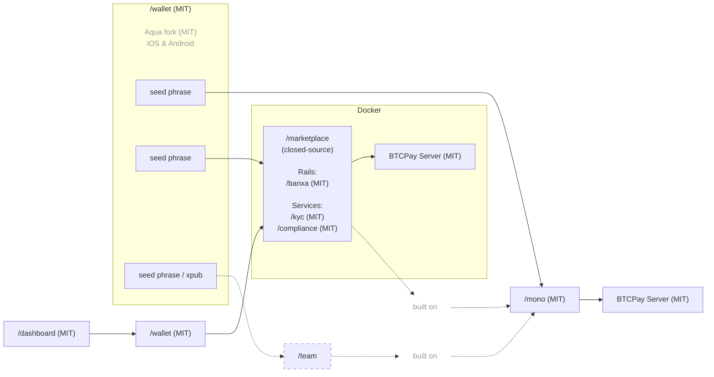
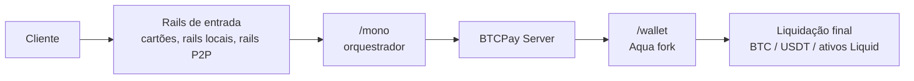

## Documentação Local2Coin

O Local2Coin é construído sobre a infraestrutura de pagamento multi-canal open-source do P2Pagos.

O P2Pagos utiliza:

- [`/mono`](https://github.com/P2Pagos/mono) como o repositório orquestrador baseado em Nuxt.
- [`/wallet`](https://github.com/P2Pagos/wallet) como a carteira de liquidação self-custodial móvel, baseada em um fork do Aqua Wallet.
- `/dashboard` como o mini app Nuxt integrado ao `/wallet` para configurações e fluxos.
- `/marketplace` como a camada multi-usuário closed-source construída sobre `/mono`.
- [BTCPay Server](https://github.com/btcpayserver/btcpayserver) como o backend para a infraestrutura de liquidação.

O stack é projetado em torno de:

- rails de entrada
- serviços modulares
- liquidação self-custodial
- arquitetura de pagamento multi-canal
- movimentação de dinheiro transfronteiriço prática
- dependência reduzida de um único processador, banco, país ou canal

---

## Papéis dos repositórios

| Repositório | Licença | Papel | Status |
|------------|---------|------|--------|
| [`/mono`](https://github.com/P2Pagos/mono) | MIT | Orquestrador Nuxt para rails, fluxos, serviços e utilitários compartilhados | Base orquestradora inicial |
| [`/wallet`](https://github.com/P2Pagos/wallet) | MIT | Fork do Aqua Wallet para liquidação self-custodial móvel e integração `/dashboard` | Camada de carteira P2Pagos planejada |
| `/dashboard` | MIT | Mini app Nuxt integrado ao `/wallet` para fluxos de pagamento e configuração | Planejado |
| `/marketplace` | Closed-source | Camada marketplace multi-usuário construída sobre `/mono` | Camada comercial |

---

## Arquitetura



---

## `/mono`

[`/mono`](https://github.com/P2Pagos/mono) é o repositório orquestrador do P2Pagos.

Ele monta rails de pagamento, fluxos de negócio, serviços de infraestrutura e utilitários compartilhados em um único workspace baseado em Nuxt.

Este repositório ainda está sendo organizado e deve ser lido como uma base orquestradora inicial, não como um produto finalizado.

### Estrutura

```txt
/
├── nuxt.config.js      app Nuxt raiz — carrega todos os módulos do workspace
├── app.vue
├── pages/
├── server/
├── rails/              módulos de rails de pagamento
├── flows/              módulos de fluxos de negócio
├── services/           módulos de serviços de infraestrutura
└── utils/              utilitários compartilhados
```

### O que o `/mono` não é

- Não é um marketplace finalizado.
- Não é um SDK público polido.
- Não está estável o suficiente para garantir uso amplo em produção.

---

## Módulos do `/mono`

### Rails

Os módulos de rails de pagamento injetam páginas, composables e handlers de servidor no app host. Também podem ser executados de forma autônoma como servidores Nitro.

| Pacote | Caminho | Página | API |
|---------|------|------|-----|
| `@p2pagos/template` | `rails/template` | `/rails/template` | `/api/rails/template` |
| `@p2pagos/peach` | `rails/peach` | `/rails/peach` | `/api/rails/peach/*` |
| `@p2pagos/robosats` | `rails/robosats` | `/rails/robosats` | `/api/rails/robosats/*` |

### Fluxos

Módulos de funcionalidades de alto nível com páginas e componentes de UI.

| Pacote | Caminho | Páginas |
|---------|------|-------|
| `@p2pagos/booking` | `flows/booking` | `/flows/booking`, `/flows/booking/embed` |

### Serviços

Módulos de infraestrutura que funcionam tanto como apps Nitro autônomos quanto como módulos Nuxt integráveis.

| Pacote | Caminho | Rotas | Notas |
|---------|------|--------|-------|
| `@p2pagos/ip` | `services/ip` | — | Limitação de taxa e geolocalização de IP, desabilitado por padrão |
| `@p2pagos/tor` | `services/tor` | `/api/tor`, `/api/tor/**` | Proxy reverso Tor, desabilitado por padrão |
| `@p2pagos/market` | `services/market` | `/api/market/**` | Agregador de ofertas sem KYC para Bisq, RoboSats e Peach, desabilitado por padrão |

---

## Rails de entrada multi-canal

| Rail | Status | Moeda | Métodos de pagamento | Liquidação | Taxa | Verificação | Privacidade |
|------|--------|----------|-----------------|------------|-----|--------------|---------|
| BTC | Implementado | SATS | On-chain e Lightning | Bitcoin on-chain | Nenhuma | Nenhuma | Total |
| USDT | Implementado | USD | Liquid e Polygon | USDT Liquid e Polygon | Nenhuma | Nenhuma | Total |
| [Peach](https://github.com/P2Pagos/mono/tree/main/rails/peach) *(p2p-api-integration)* | Testing | Global | Qualquer | Bitcoin on-chain | Alta | Nenhuma | Total |
| [RoboSats](https://github.com/P2Pagos/mono/tree/main/rails/robosats) *(p2p-api-integration)* | Testing | Global | Qualquer | Bitcoin on-chain | Alta | Nenhuma | Total |
| MoonPay ACH USD *(cex-api-integration)* | Projetando | USD | ACH | USDT(?) | Nenhuma | Padrão | Nenhuma |
| Mostro *(p2p-api-integration)* | Avaliando | Global | Qualquer | Bitcoin on-chain | Alta | Nenhuma | Total |
| Guardarian *(cex-api-integration)* | Planejado | USD, EUR, GBP, CAD, AUD, JPY, TRY, PLN, SEK | Cartões de crédito/débito e Google/Apple Pay | Bitcoin on-chain | Média | Nenhuma ou Padrão | Possível com estrutura RUC |
| Paygate *(cex-api-integration)* | Planejado | Global | Cartões de crédito/débito | USDT Polygon | Média | Nenhuma | Total |
| DePix *(cex-api-integration)* | Planejado | BRL | Pix | BRL no Liquid | Baixa | Nenhuma | Total |
| Kamipay *(cex-api-integration)* | Planejado | BRL | Pix | USDT Polygon | Baixa | Padrão | Nenhuma |
| MtPelerin *(cex-api-integration)* | Planejado | EUR e CHF | SEPA | Bitcoin on-chain ou USDT Polygon | Baixa | Reforçada | Possível com estrutura RUC |
| Bitzed *(cex-api-integration)* | Planejado | ZMW | Mobile money | Bitcoin on-chain | Baixa | Nenhuma | Total |
| Matbea *(cex+p2p-api-integration)* | Planejado | RUB | Yandex Pay, Sberbank, Tinkoff, YooMoney, SBP P2P, móvel | Bitcoin on-chain | Baixa | Nenhuma | Total |

---

## Módulos de serviço

| Serviço | Status | Escopo | Propósito | Padrão |
|---------|--------|-------|---------|---------|
| [ip](https://github.com/P2Pagos/mono/tree/main/services/ip) | Testing | Global | Geolocalização de IP, detecção de país e moeda, limitação de taxa | Desabilitado por padrão |
| [tor](https://github.com/P2Pagos/mono/tree/main/services/tor) | Testing | Global | Proxy reverso Tor para integrações onion | Habilitado se consumido por um rail ativo |
| [cors](https://github.com/P2Pagos/mono/tree/main/services/cors) | Testing | Global | Proxy reverso CORS para APIs alvo | Habilitado se consumido por um rail ativo |
| [market](https://github.com/P2Pagos/mono/tree/main/services/market) | Testing | Global | Agregação de ofertas sem KYC e ofertas externas | Habilitado se consumido por um rail ativo |
| invoice | Planejado | Múltiplos países, muitos no LATAM | Geração programática de notas fiscais eletrônicas ao liquidar o pagamento, baseado no Invopop, com integração SIFEN Paraguai planejada através dos módulos TIPS SA | Desabilitado por padrão |

---

## Desenvolvimento local do `/mono`

```bash
pnpm install
pnpm dev
pnpm build
pnpm preview
```

---

## Carregamento de módulos no `/mono`

O app Nuxt raiz carrega os módulos do workspace através do `nuxt.config.js`.

Adicionar um módulo requer:

1. Adicionar `"@p2pagos/<name>": "workspace:*"` às dependências do `package.json` raiz.
2. Adicionar `'@p2pagos/<name>'` ao array `modules` no `nuxt.config.js`.

`flows/booking` requer `@nuxt/ui`. Deve estar presente no `nuxt.config.js` antes ou junto ao módulo de booking.

---

## Variáveis de ambiente do `/mono`

### `services/tor`

| Variável | Obrigatória | Padrão | Descrição |
|----------|----------|---------|-------------|
| `NUXT_TOR_PROXY_SECRET` | Sim | — | Segredo compartilhado enviado no header `X-Tor-Proxy-Secret` |
| `NUXT_TOR_SOCKS_URL` | Não | `socks5h://127.0.0.1:9050` | URL SOCKS5h do daemon Tor local |

### `rails/robosats`

| Variável | Obrigatória | Padrão | Descrição |
|----------|----------|---------|-------------|
| `NUXT_ROBOSATS_COORDINATOR_URL` | Não | Onion padrão do RoboSats | URL onion base do coordenador |
| `NUXT_TOR_PROXY_SECRET` | Sim | — | Segredo compartilhado para o proxy `@p2pagos/tor` integrado |
| `NUXT_TOR_SOCKS_URL` | Não | `socks5h://127.0.0.1:9050` | URL SOCKS5h do daemon Tor local |

### `rails/peach`

| Variável | Obrigatória | Padrão | Descrição |
|----------|----------|---------|-------------|
| `NUXT_PEACH_BASE_URL` | Não | `https://api.peachbitcoin.com` | URL base da API do Peach |
| `NUXT_PEACH_BITCOIN_MNEMONIC` | Sim | — | Mnemônico BIP39 para derivação de chaves da carteira |
| `NUXT_PEACH_PGP_PRIVATE_KEY` | Sim | — | Chave privada PGP em formato armored |
| `NUXT_PEACH_PGP_PUBLIC_KEY` | Sim | — | Chave pública PGP em formato armored |
| `NUXT_PEACH_PGP_PASSPHRASE` | Sim | — | Frase de senha da chave PGP |
| `NUXT_PEACH_REFERRAL_CODE` | Não | — | Código de referral do Peach |
| `NUXT_PEACH_FEE_RATE` | Não | `hourFee` | Estratégia de taxa de comissão do Bitcoin |
| `NUXT_PEACH_MAX_PREMIUM` | Não | `0` | Prêmio máximo aceito em ofertas |

### `services/ip`

| Variável | Obrigatória | Padrão | Descrição |
|----------|----------|---------|-------------|
| `NUXT_IP_DETECTION_CURRENCY` | Não | `false` | Expõe a moeda derivada do header `cf-ipcountry` do Cloudflare em `event.context.ipDetection` |
| `NUXT_IP_DETECTION_COUNTRY` | Não | `false` | Expõe o código do país em `event.context.ipDetection` |
| `NUXT_IP_DETECTION_CLOUDFLARE_SECRET` | Não | — | Segredo compartilhado para verificar que as requisições vêm pelo Cloudflare |
| `NUXT_IPINFO_API_KEY` | Não | — | API key do IPinfo |
| `NUXT_IP_DETECTION_RATE_LIMIT` | Não | `100` | Máximo de requisições por IP por minuto |
| `NUXT_IP_DETECTION_LIMIT_PATHS` | Não | — | Lista de caminhos de API separados por vírgula para limitar taxa |

### `services/market`

| Variável | Obrigatória | Padrão | Descrição |
|----------|----------|---------|-------------|
| `NUXT_TOR_PROXY_SECRET` | Sim | — | Segredo de autenticação para o handler do proxy Tor inline |
| `NUXT_ROBOSATS_COORDINATOR_ONION_URL` | Não | Onion padrão do RoboSats | Endereço onion do coordenador do RoboSats |
| `NUXT_TOR_SOCKS_URL` | Não | `socks5h://127.0.0.1:9050` | URL SOCKS5h do daemon Tor local |

---

## Problemas conhecidos do `/mono`

| Problema | Detalhe |
|-------|--------|
| Incompatibilidade de versão do `@nuxt/kit` | `rails/peach`, `rails/robosats` e `services/tor` declaram `@nuxt/kit ^3.13.0`, enquanto o app raiz, `rails/template` e `flows/booking` usam `^4.0.0`. Os módulos funcionam em modo de módulo através da instância kit do Nuxt, mas a migração standalone completa para `^4.0.0` está pendente. |

---

## `/wallet`

[`/wallet`](https://github.com/P2Pagos/wallet) é a carteira móvel self-custodial do P2Pagos, baseada em um fork do [Aqua Wallet](https://github.com/aquawallet/).

Este repositório existe porque o Aqua já fornece uma base sólida para a camada de liquidação que o P2Pagos precisa, ao mesmo tempo em que permite extensão para fluxos de pagamento específicos do P2Pagos, gestão de configurações e integrações com marketplaces.

---

## Por que o Aqua Wallet

O Aqua Wallet foi selecionado como base deste fork porque já oferece:

| Funcionalidade | Razão |
|---------|--------|
| Self-custody de Bitcoin e Liquid | Suporte self-custodial nativo com um único backup de seed phrase |
| Lightning através do Boltz | Os fluxos swap-to-Liquid reduzem a necessidade de os usuários gerenciarem a liquidez de canais diretamente |
| Stablecoins no Liquid | Suporte para múltiplas stablecoins baseadas em Liquid, atualmente USDT e DePix |
| Swaps integrados | Capacidade de swap entre moedas suportadas |
| Modelo de marketplace externo | Pode ser substituído pelo mini app integrado do P2Pagos para `/settings` ou `/dashboard` |
| Múltiplas carteiras | Seed phrases separadas permitem ao mesmo usuário conectar-se ao `/mono` e a uma ou mais contas `/marketplace` |
| Protocolo Shamrock | Permite conexão simples ao BTCPay Server |
| Expectativas de manutenção | O Aqua tem financiamento sólido e boa reputação no ecossistema |

---

## Mudanças planejadas no `/wallet`

O fork atual é projetado para evoluir para a carteira móvel de liquidação e configuração do P2Pagos.

As mudanças planejadas incluem:

- Adicionar suporte a carteira Polygon self-custodial derivado da seed phrase existente, para suportar USDT no Polygon.
- Se necessário para rails futuros liquidando em USDT em outras redes, estender o suporte através de interoperabilidade baseada em USDT0, usando Polygon como rede âncora principal.
- Substituir a aba de marketplace do Aqua por uma aba **Pagamentos** dedicada, alimentada pelo mini app Nuxt `/dashboard`.
- Integrar taxas de câmbio do `yadio.io`, mais representativas do preço real em mercados emergentes do que fontes apenas de exchanges como Kraken.
- Melhorar continuamente a funcionalidade base incorporando regularmente mudanças upstream do Aqua.
- Remover a distinção entre **Saving Account** para BTC e **Spending Accounts** para outros ativos, para se adequar melhor ao modelo de produto orientado a pagamentos do P2Pagos.
- Adicionar russo e remover idiomas desnecessários, alinhando a carteira ao conjunto de idiomas padrão: EN, ES, PT, FR, IT, RU.
- Fazer o rebranding da aplicação como parte da família de produtos P2Pagos.

---

## USDT no Polygon

Uma das principais adições planejadas é o suporte self-custodial de USDT no Polygon.

O objetivo é dar aos usuários acesso a um ativo de liquidação amplamente utilizável nos rails de pagamento integráveis, preservando o mesmo modelo de propriedade de carteira já usado para Bitcoin e ativos Liquid.

A implementação é projetada em torno de:

- derivar o suporte à carteira Polygon da mesma seed phrase existente;
- suportar USDT no Polygon como ativo de liquidação de primeira classe;
- usar um stack EVM em Flutter para derivação de contas Polygon, assinatura e interação com contratos;
- avaliar `web3dart` e `onchainlabs_flutter`;
- minimizar a exposição do usuário à complexidade operacional do token nativo;
- gerenciar as taxas de rede através de um fluxo ERC-4337 paymaster;
- abstrair as taxas da experiência normal do usuário;
- cobrar taxas em USDT em vez de exigir gerenciamento manual de MATIC.

---

## Integração do mini app `/dashboard`

O mini app `/dashboard` será integrado à carteira através de uma abordagem baseada em WebView.

Modelo de segurança:

| Camada | Responsabilidade |
|-------|----------------|
| Flutter | Custódia da seed phrase e chaves privadas |
| App Nuxt integrado | UI de pagamentos e interface de configuração |
| Ponte de capacidades | Comunicação limitada entre Flutter e WebView |
| Camada WebView | Recebe apenas os dados e ações necessários |

O app Nuxt integrado não recebe acesso direto aos segredos.

A ponte é limitada aos dados e ações necessários para a UI de pagamentos:

- endereços de recebimento
- contexto básico da carteira
- solicitações de assinatura

---

## Resumo do fluxo de liquidação



---

## Modelo operacional

| Camada | Função |
|-------|----------|
| Rails de entrada | Aceitar ou rotear pagamentos através de métodos de pagamento suportados |
| `/mono` | Montar rails, fluxos, serviços e handlers de API |
| BTCPay Server | Backend de liquidação e infraestrutura de pagamento |
| `/wallet` | Camada móvel self-custodial de liquidação e configuração |
| `/dashboard` | Interface Nuxt integrada para configuração e fluxos de pagamento |
| `/marketplace` | Camada comercial multi-usuário construída sobre `/mono` |

---

## Status atual

O P2Pagos ainda está em evolução.

Alguns componentes existem como integrações funcionais. Outros são parciais, experimentais, planejados ou ainda sendo montados no orquestrador principal.

Os repositórios devem ser lidos como trabalho de infraestrutura ativo, não como um conjunto de produtos finalizado.
